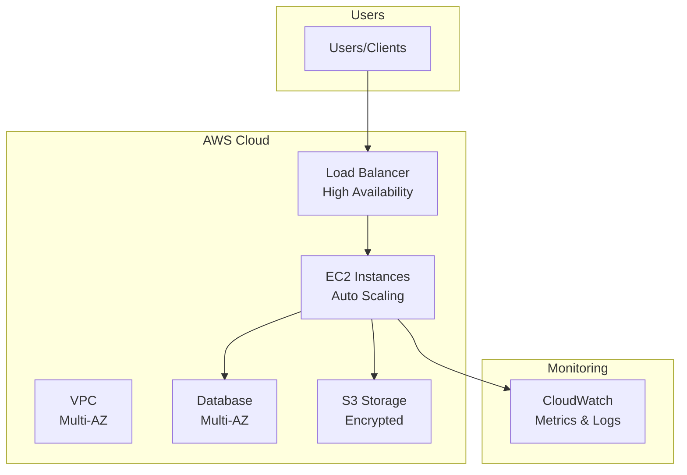

# 🏘️ Real Estate Platform - AWS CloudFormation Case Study

> **Full-stack scalable real estate platform** with 50,000 listings, 30,000 monthly users, and advanced features

[](https://aws.amazon.com/cloudformation/)
[](https://aws.amazon.com/)
[](LICENSE)

## 🎯 Problem Statement

Build a **production-ready real estate platform** that handles:
- **50,000 property listings** with 3D virtual tours
- **30,000 monthly visitors** at peak
- **Geospatial search** for location-based queries
- **Mortgage calculators** and tools
- **Appointment scheduling**
- **User authentication** (agents & buyers)
- **Image processing** and optimization
- **High availability** across multiple AZs

## 💡 Solution Overview

Complete serverless & containerized architecture using:
- **ECS Fargate**: Containerized web application
- **Aurora MySQL**: Primary database with read replicas
- **DynamoDB**: User favorites and search history
- **ElastiCache**: Redis for caching and sessions
- **OpenSearch**: Geospatial property search
- **Lambda**: Image processing, mortgage calculator
- **API Gateway**: RESTful APIs
- **Cognito**: User authentication
- **S3 + CloudFront**: Static content delivery
- **WAF**: Security protection

## 🏗️ Architecture

### High-Level Architecture




## 🚀 Quick Deploy

```bash
aws cloudformation create-stack \
  --stack-name real-estate-platform \
  --template-body file://TapStack.yml \
  --capabilities CAPABILITY_IAM \
  --region us-east-2 \
  --parameters \
    ParameterKey=Environment,ParameterValue=production
```

**Deployment Time**: 30-40 minutes

## 💰 Cost Analysis

### Development Environment
**Monthly**: $200-300
- ECS Fargate: $60
- Aurora: $50
- OpenSearch: $40
- ElastiCache: $15
- Other services: $35-135

### Production Environment
**Monthly**: $800-1,200
- ECS Fargate (scaled): $200
- Aurora + Replicas: $250
- OpenSearch (large): $180
- ElastiCache: $60
- CloudFront: $50
- Other services: $60-460

## ✨ Key Features

### For Users
- ✅ Property search with map view
- ✅ 3D virtual tours
- ✅ Mortgage calculator
- ✅ Appointment booking
- ✅ Favorites and search history
- ✅ Email notifications
- ✅ Mobile-responsive

### For Agents
- ✅ Property management
- ✅ Lead tracking
- ✅ Calendar integration
- ✅ Analytics dashboard

### Technical Features
- ✅ Sub-100ms cached queries
- ✅ Geospatial search (OpenSearch)
- ✅ Auto-scaling (ECS + Aurora)
- ✅ CDN global delivery
- ✅ WAF security
- ✅ Multi-AZ high availability
- ✅ Automated backups
- ✅ Monitoring & alerts

## 📊 Performance

- **Search Response**: <100ms (cached)
- **Image Load**: <500ms (CloudFront)
- **API Response**: <200ms (average)
- **Geospatial Query**: <150ms (OpenSearch)
- **Concurrent Users**: 10,000+
- **Availability**: 99.95%

## 🎯 Use Cases

Perfect for:
- Real estate marketplaces
- Property listing platforms
- Real estate agent portals
- Property management systems
- Commercial real estate platforms

## 📚 Documentation

- **[ARCHITECTURE.md](ARCHITECTURE.md)** - Complete architecture breakdown
- **[DEPLOYMENT.md](DEPLOYMENT.md)** - Step-by-step deployment
- **[SCALING.md](docs/SCALING.md)** - Scaling strategies
- **[COST_ANALYSIS.md](docs/COST_ANALYSIS.md)** - Detailed costs
- **[FEATURES.md](docs/FEATURES.md)** - Feature documentation
- **[API_GUIDE.md](docs/API_GUIDE.md)** - API documentation

## 🔧 Technology Stack

**Frontend**: React, CloudFront, S3
**Backend**: Node.js/Python, ECS Fargate
**Database**: Aurora MySQL, DynamoDB
**Cache**: ElastiCache Redis
**Search**: Amazon OpenSearch
**APIs**: API Gateway, Lambda
**Auth**: Amazon Cognito
**Storage**: S3
**CDN**: CloudFront
**Security**: WAF, KMS, Security Groups
**Monitoring**: CloudWatch, X-Ray

## 🌟 Highlights

- **Serverless where possible**: Lambda, API Gateway, DynamoDB
- **Containers for flexibility**: ECS Fargate for web app
- **Managed services**: Aurora, OpenSearch, ElastiCache
- **Global scale**: CloudFront CDN
- **Cost-optimized**: Right-sized services
- **Production-ready**: HA, monitoring, security

## 🎤 Interview Showcase

This project demonstrates:
- ✅ **Full-stack architecture** design
- ✅ **Microservices** patterns
- ✅ **Serverless** + **containers** hybrid
- ✅ **Geospatial** search implementation
- ✅ **Multi-tier** application design
- ✅ **Cost optimization** strategies
- ✅ **Scalability** planning
- ✅ **Security** best practices

## 👤 Author

**Rahul Ladumor**
- GitHub: [@rahulladumor](https://github.com/rahulladumor)
- Project: Real Estate Platform Case Study

## 📄 License

MIT License

---

**⭐ Production-grade real estate platform architecture!**
